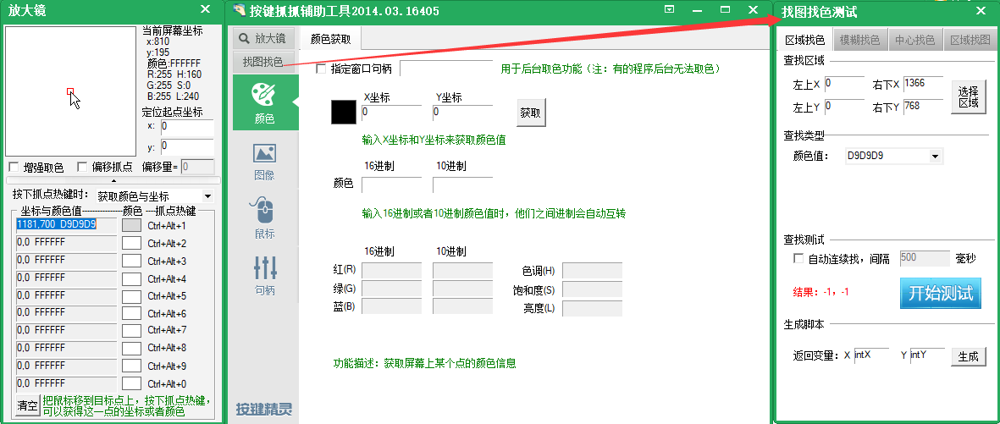
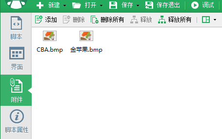

# FGO_auto
~~迫于无限池刷的过于精污，又想同时看番剧~~  
~~初学者预警~~  
本脚本请直接在按键精灵新建脚本，粘贴，修改后保存即可使用  
[点击查看](./WCBA循环刷图)  
欢迎提交issues
***
运行原理
------

使用方法
-------
* 修改需要点击的位置坐标  
* 修改图片查找区域坐标  
* 修改图片识别灵敏度  

`MoveTo 940, 231//关卡入口点击`
此处`940, 231`改为你的关卡入口坐标  ⚠️`940,`后有空格  
坐标获取可以使用按键精灵自带的抓抓功能  
  
在`FindPic 314,118,529,561,"Attachment:\金苹果.bmp",0.9,intA,intB`中  
`314,118,529,561`指的是查找图片的区域，此处指金苹果的图片  
`0.9`指图片的相似度，请根据体感自行调整  
`Attachment:\金苹果.bmp`指需要查找的图片路径，这里将图片放在了按键精灵自带的附件功能里  

  
随意查找一个区域，生成脚本示例为  
```
FindPic 575,278,755,364,"Attachment:\金苹果.bmp",0.9,intX,intY
If intX> 0 And intY> 0 Then
End If
```
删掉`If intX> 0 And intY> 0 Then End If`替换坐标区域即可  
`MoveTo intA + 20, intB + 20`这里指查找到的金苹果坐标位置  
点击为左上角坐标，加入数值`20`进行变更，可依据自己随意更改  
`MoveTo 835, 538 //确认框位置` 金苹果点击后弹出的确定使用按钮位置，自行更改  

在`Sub CBA助战()`中
```
        Else //i≠1时
            MoveTo 941, 345
            Delay 1000
            MouseWheel -1 //鼠标滚轮一次（向下）
            Delay 1000
        End If
    Wend
```  
此处的`Else //i≠1时`指当前显示好友列表没有找到CBA助战  
` MoveTo 941, 345`将鼠标移动至好友列表任意位置  
`MouseWheel -1 `来将鼠标滚轮一次（向下）此处`-1`改为`1`时为向上滚动  
直到找到CBA助战为止  

最后一行`Delay 15000`延迟15秒后开始下一次循环，此时正在跑芙芙，请根据个人体感更改数值  

待添加功能
---------
- [x] 自动循环
- [x] 助战选择
- [ ] 关卡三面判定
- [ ] 战斗结束精确判断
- [ ] 羁绊、礼装、人物升级判断

~~咕咕咕咕咕咕咕咕咕咕咕~~


